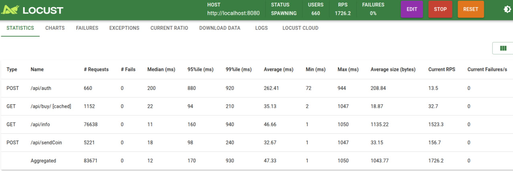

# Avito Merch Shop

Микросервис для управления виртуальными монетами и покупки мерча в Avito.

## Быстрый старт

### Требования
- Docker 20.10+
- Docker Compose 2.20+

### Запуск в Docker
1. Клонировать репозиторий:
   ```bash
   git clone https://github.com/maksemen2/avito-task.git
   cd avito-task
   ```
2. Запустить сервисы:
   ```bash
   make deploy
   
   # Или
   docker compose up --build
   ```

Сервис будет доступен на `http://localhost:8080`

### Makefile цели
```bash
make lint       # Проверка стиля кода
make lint-fix   # Автоисправление стиля
make build      # Сборка проекта
make run        # Локальный запуск
make deploy     # Запуск в Docker
make tests      # Запуск тестов
```

## Стек

**Основные компоненты:**
- **Язык:** Go 1.22
- **Фреймворк:** Gin
- **База данных:** PostgreSQL
- **ORM:** GORM
- **Логирование:** Zap
- **JWT:** golang-jwt

**Тестирование:**
- Юнит-тесты: testify
- E2E тесты: httptest

## Тестирование

**Запуск тестов:**
```bash
make tests

# Или

go test -v --cover ./internal/services/... ./internal/repository/... ./internal/handlers/...
```

1. Покрытие кода тестами выше 40%
2. Написаны E2E тесты всех сценариев, которые я смог придумать

## Нагрузочное тестирование

Результаты тестирования с использованием Locust (Python 3.6+):

**Сценарий:**
1. Авторизация пользователя
2. Случайные переводы монет
3. Покупка случайного товара
4. Проверка баланса
5. Получение информации при невозможности операций

В данном тесте ошибочными считаются ответы 500, 401 и 504. При 500 и 504 коде сервер не обработал запрос как нужно, а при 401 - запрос не попал в хендлер.


**Метрики:**
- **RPS:** 1726.2
- **Среднее время ответа:** 47.33 мс
- **Успешность:** 100%
- **Операции:**
  - Покупки: 9,096
  - Переводы: 18,014
  - Пользователи: 4,961



**Запуск теста:**
```bash
pip install locust
locust -f load_test/locustfile.py --host=http://localhost:8080
```

## Линтинг

Конфигурация линтера: [.golangci.yaml](.golangci.yaml)

Проверяемые правила:
- bodyclose
- dupl
- gochecknoglobals
- gochecknoinits
- goconst
- gocyclo
- gofmt
- misspell
- nakedret
- rowserrcheck
- copyloopvar
- stylecheck
- unconvert
- whitespace
- wsl
